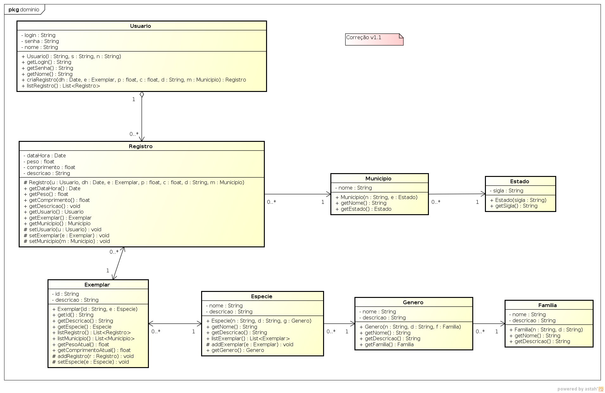

<h1 align="center">Registro de Exemplares Avistados</h1>

Este sistema permite o gerenciamento de avistamentos e capturas de exemplares, fornecendo uma estrutura clara para a classificação e registro de informações detalhadas sobre os animais avistados

<h2 align="center">Funcionalidades</h2>

<h3>Principais Funcionalidades</h3>
<ul>
    <li><strong>Registro de Avistamentos:</strong> Registre quando e onde um exemplar foi avistado, juntamente com detalhes como peso e comprimento.</li>
    <li><strong>Gerenciamento de Exemplares:</strong> Mantenha um histórico de todos os avistamentos e medições de cada exemplar.</li>
    <li><strong>Classificação Taxonômica:</strong> Classifique exemplares em Espécies, Gêneros e Famílias para uma melhor organização.</li>
</ul>

<h2 align="center">Estrutura do Sistema</h2>

<h3>Classes Principais</h3>

<h4>Usuario</h4>

Representa um usuário do sistema.

**Métodos:**
- `criaRegistro(dh: Date, e: Exemplar, p: float, c: float, d: String, m: Municipio)`: Cria um registro para um exemplar existente no sistema. Instancia um `Registro` com a data e hora (`dh`), peso (`p` ou 0 se não houver pesagem), comprimento (`c` ou 0 se não houver medição), município (`m`), e descrição (`d`). Associa o `Registro` ao `Exemplar` e ao `Usuario`. Retorna o `Registro` instanciado.
- `listRegistro()`: Retorna uma lista de todos os registros do `Usuario`.

<h4>Registro</h4>

Representa o registro/avistamento efetuado para um exemplar.

**Atributos:**
- Data e hora do registro/avistamento
- Peso ou zero caso não tenha sido realizada a pesagem
- Comprimento ou zero caso não tenha sido realizada a medição
- Município onde foi avistado o exemplar
- Descrição do avistamento/registro (opcional)

**Métodos:**
- `getUsuario()`: Retorna o `Usuario` que efetuou o registro.
- `getExemplar()`: Retorna o `Exemplar` ao qual se refere o registro.
- `getMunicipio()`: Retorna o `Municipio` ao qual se refere o registro.
- `setUsuario(u: Usuario)`: Efetiva a navegabilidade `Registro->Usuario`.
- `setExemplar(e: Exemplar)`: Efetiva a navegabilidade `Registro->Exemplar`.
- `setMunicipio(m: Municipio)`: Efetiva a navegabilidade `Registro->Municipio`.

<h4>Exemplar</h4>

Representa um exemplar avistado.

**Atributos:**
- ID
- Descrição

**Métodos:**
- `getEspecie()`: Retorna a `Especie` do exemplar.
- `listRegistro()`: Retorna uma lista com todos os registros (avistamentos) feitos para o exemplar.
- `listMunicipio()`: Retorna uma lista com todos os municípios que tenham registro para o exemplar.
- `getPesoAtual()`: Retorna o peso atual do exemplar, ou seja, o registro mais atual do peso, que tenha valor maior que zero.
- `getComprimentoAtual()`: Retorna o comprimento atual do exemplar, ou seja, o registro mais atual do comprimento, que tenha valor maior que zero.
- `addRegistro(r: Registro)`: Efetiva a navegabilidade `Exemplar->Registro`.
- `setEspecie(e: Especie)`: Efetiva a navegabilidade `Exemplar->Especie`.

<h4>Municipio</h4>

Representa um município onde os exemplares são avistados. Contém atributos triviais, getters e setters.

<h4>Estado</h4>

Representa um estado. Contém atributos triviais, getters e setters.

<h4>Especie</h4>

Representa uma espécie, que contém vários exemplares.

**Métodos:**
- `listExemplar()`: Retorna uma lista com todos os exemplares associados a esta `Especie`.
- `addExemplar(e: Exemplar)`: Efetiva a navegabilidade `Especie->Exemplar`.

<h4>Genero</h4>

Representa um gênero, que contém várias espécies. Contém atributos triviais, getters e setters.

<h4>Familia</h4>

Representa uma família, que contém vários gêneros. Contém atributos triviais, getters e setters.

<h2 align="center">Diagrama de Classes</h2>

  

<h2>Como Executar</h2>

<ol>
    <li>Implemente as classes em Java conforme descrito.</li>
    <li>Utilize os métodos fornecidos para criar usuários, registrar avistamentos, e consultar registros e informações de exemplares.</li>
    <li>Garanta que todos os relacionamentos e navegabilidades estejam corretamente implementados conforme o diagrama de classes.</li>
</ol>

